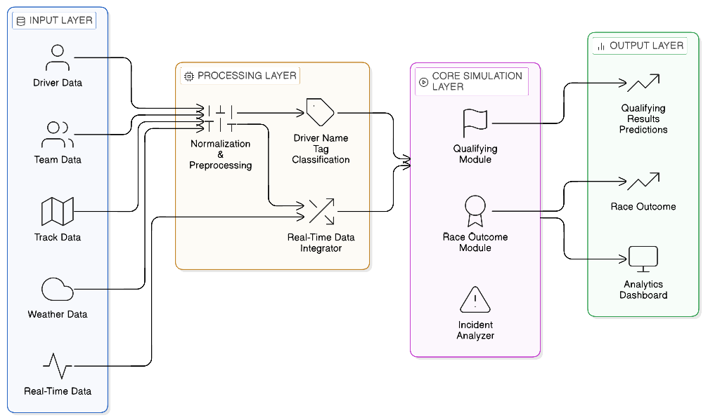
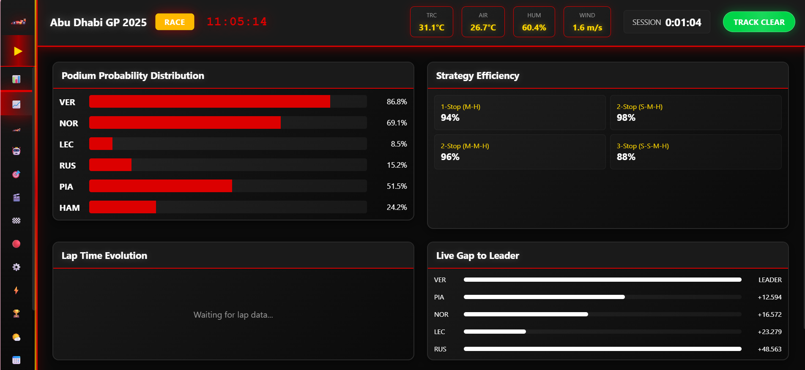
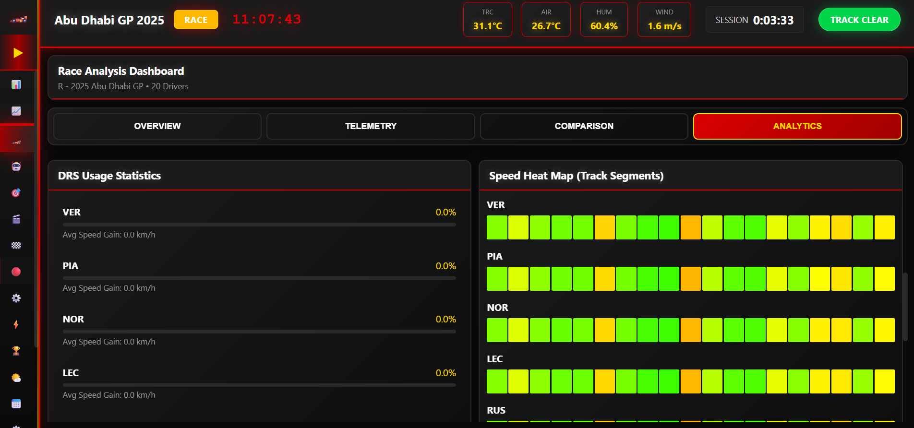
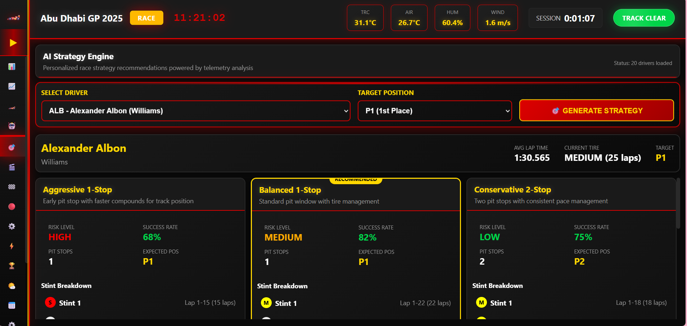
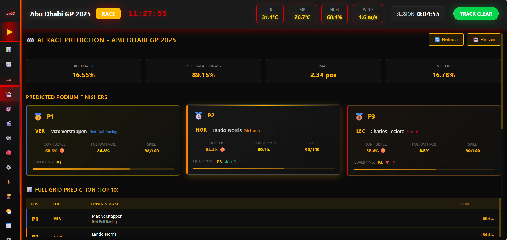

# 🏎️ F1-Track-AI  
## Enterprise AI Platform for Real-Time Formula 1 Strategy Intelligence  

> Transforming live Formula 1 telemetry into predictive race strategy decisions.

---

## 🚀 Overview

**F1-Track-AI** is a real-time AI-driven race intelligence platform designed to deliver predictive analytics, strategy optimization, and probabilistic simulation for Formula 1 events.

Unlike traditional post-race analytics tools, this system provides **live decision-support intelligence** by integrating telemetry data, weather inputs, machine learning models, and strategy engines into a unified platform.

---

## 🎯 Core Modules

### 🏁 Race Outcome Prediction
- Real-time win probability estimation  
- Podium probability forecasting  
- Dynamic position evolution modeling  
- Classification using Gradient Boosting  

---

### 🛞 Tyre Degradation Intelligence
- Compound wear prediction  
- Stint length estimation  
- Degradation curve visualization  
- Random Forest regression models  

---

### ⛽ Strategy Engine
The optimization core of the platform.

- Optimal pit window calculation  
- Compound switching recommendations  
- Undercut / Overcut simulation  
- Fuel load impact modeling  
- Risk-adjusted strategy scoring  

---

### 📊 Monte Carlo Strategy Simulator
- Large-scale probabilistic simulations  
- Win probability distribution  
- Expected finishing position modeling  
- Strategic robustness evaluation  

---

### 🌧️ Weather Intelligence Integration
- Live meteorological ingestion  
- Rain onset prediction  
- Grip level modeling  
- Adaptive compound strategy adjustment  

---

### 📈 Race Analysis Module
Advanced race diagnostics:

- Lap time evolution  
- Driver pace comparison  
- Gap progression analysis  
- Sector-wise breakdown  
- Overtake probability modeling  

---

### 📊 Strategy Analysis Module
Post-simulation evaluation system:

- Multi-strategy comparison  
- Risk profiling  
- Aggressive vs Conservative modeling  
- Strategy performance scorecards  
- Optimization benchmarking  

---

### 🖥️ Interactive Dashboard
Built using **Streamlit / Dash**

- Live prediction visualization  
- Degradation curve graphs  
- Strategy comparison interface  
- Parameter-based "what-if" simulations  

---

## 🏗️ System Architecture

Data Ingestion Layer
        ↓
Preprocessing & Feature Engineering
        ↓
Multi-Model ML Engine
        ↓
Strategy Optimization Engine
        ↓
Monte Carlo Simulation Layer
        ↓
Race & Strategy Analysis Modules
        ↓
Interactive Visualization Dashboard


---

## 📷 Architecture Diagram


```markdown


📊 Dashboard Preview





🎥 Working Demo
[▶ Watch Live Demo](https://your-demo-link.com)


🧠 Machine Learning Stack
| Module       | Model               |
| ------------ | ------------------- |
| Race Outcome | Gradient Boosting   |
| Tyre Wear    | Random Forest       |
| Simulation   | Monte Carlo         |
| Time-Series  | LSTM (Future Scope) |


⚙️ Tech Stack

-Python
-Scikit-learn
-Pandas / NumPy
-Matplotlib / Plotly
-FastF1 API
-Weather APIs
-Streamlit / Dash


📦 Installation
1️⃣ Clone Repository
git clone https://github.com/ALAN20SIG/F1-Track-AI.git
cd F1-Track-AI


2️⃣ Create Virtual Environment
python -m venv venv
source venv/bin/activate     # Mac/Linux
venv\Scripts\activate        # Windows


3️⃣ Install Dependencies
pip install -r requirements.txt


4️⃣ Run Application
streamlit run app.py


📈 Business Impact
| Traditional Approach   | F1-Track-AI              |
| ---------------------- | ------------------------ |
| Post-race review       | Real-time intelligence   |
| Static strategy        | Dynamic optimization     |
| Manual decision making | AI-assisted planning     |
| Deterministic models   | Probabilistic simulation |

🔮 Future Roadmap

-Reinforcement Learning for adaptive strategy
-Transformer-based telemetry forecasting
-Cloud deployment architecture
-Real-time streaming ingestion (Kafka)
-Bayesian uncertainty modeling

📜 License

-MIT License

⭐ Support

If you find this project valuable:
⭐ Star the repository
🍴 Fork it
📢 Share it


---

This version will render cleanly on GitHub with:

- Proper spacing
- Clean code blocks
- Table alignment
- Structured headers
- No formatting breaks

---

If you'd like, I can now give you:

- A version with **GitHub badges (build, Python, license, AI, etc.)**
- A version that looks like a **real startup SaaS landing page**
- Or a version optimized to impress recruiters & hiring managers**

Tell me which direction you want 🚀


